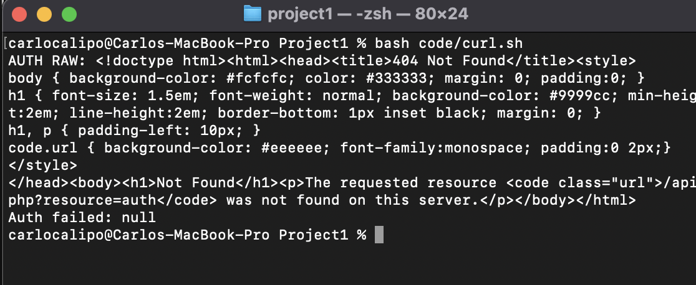
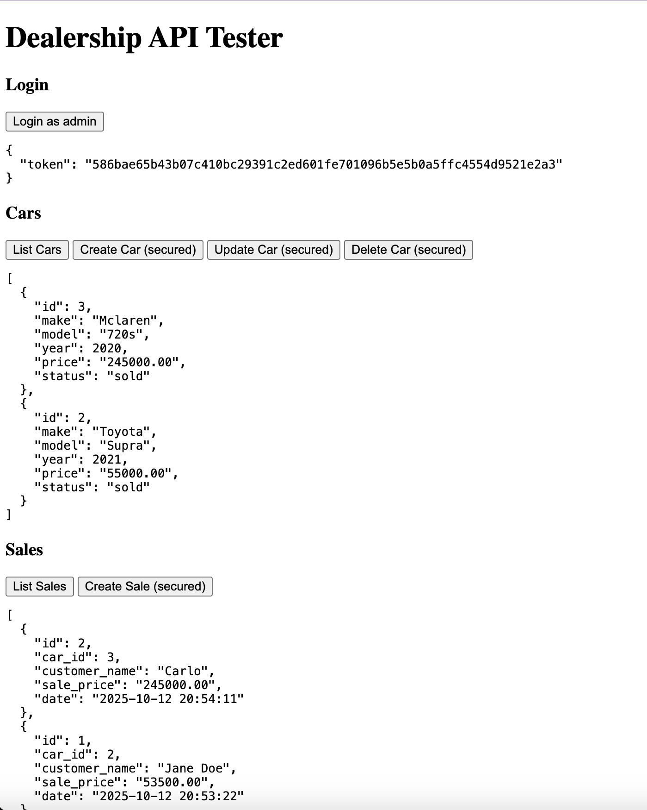

# ASE230 Project 1
## Dealership REST API Overview
- Carlo Calipo
- PHP / MySQL / NGINX deployment

---

# Presentation Roadmap
- Project objective & architecture
- Authentication design
- API catalogue with request / response samples
- Testing strategy and evidence
- Deployment to NGINX
- Operational refinements & next steps

---

# Technology Stack
- PHP 8.2 with PDO (no framework dependencies)
- MySQL 8 (Homebrew-managed service)
- JSON payloads for all requests and responses
- Bearer token authorization for state-changing endpoints
- Tooling: `code/curl.sh`, `code/tests.html`, `schema.sql`

---

# API Catalogue
1. `POST /api.php?resource=auth` — Authenticate & issue token
2. `GET /api.php?resource=cars` — Retrieve inventory
3. `GET /api.php?resource=cars&id={id}` — Retrieve specific vehicle
4. `POST /api.php?resource=cars` — Create vehicle *(token required)*
5. `PUT /api.php?resource=cars&id={id}` — Update vehicle *(token required)*
6. `DELETE /api.php?resource=cars&id={id}` — Remove vehicle *(token required)*
7. `GET /api.php?resource=sales` — List recorded sales
8. `POST /api.php?resource=sales` — Record sale *(token required)*

---

# Environment Setup
- Start database: `brew services start mysql`
- Provision schema: `mysql -u root -p < code/schema.sql`
- Admin credentials: username `admin`, password `Carlo`
- Launch development API: `php -S localhost:3000 -t code`
- Verify readiness: `GET http://localhost:3000/api.php`

---

# Database Schema
- `cars`: `id`, `make`, `model`, `year`, `price`, `status`
- `sales`: `id`, `car_id`, `customer_name`, `sale_price`, `date`
- `staff`: `id`, `username`, `password_hash`, `role`, `token`
- Foreign key: `sales.car_id → cars.id (ON DELETE CASCADE)`

---

# Authentication Flow
1. Client submits credentials to `POST /api.php?resource=auth`
2. Server retrieves salted hash from `staff` and validates password
3. Token generated via `random_bytes(32)` and persisted on staff record
4. Response returns `{"token": "<64 hex characters>"}`
5. Subsequent protected requests include `Authorization: Bearer <token>`

---

# Authentication Example
```http
POST /api.php?resource=auth
Content-Type: application/json

{
  "username": "admin",
  "password": "Carlo"
}
```

Response `200 OK`:
```json
{ "token": "f5b4c8e7..." }
```

---

# Cars – List All
`GET /api.php?resource=cars`
- Public endpoint returning the fleet ordered by newest first
- Utilizes PDO prepared statements to avoid injection

Request:
```http
GET /api.php?resource=cars
```

Response `200 OK`:
```json
[{"id":1,"make":"Toyota","model":"Supra","year":2021,
  "price":"55000.00","status":"available"}]
```

---

# Cars – Retrieve One
`GET /api.php?resource=cars&id={id}`
- Public endpoint for a single vehicle record
- Returns `404` JSON when the identifier does not exist

Request:
```http
GET /api.php?resource=cars&id=1
```

Response `200 OK`:
```json
{"id":1,"make":"Toyota","model":"Supra","year":2021,
 "price":"55000.00","status":"available"}
```

---

# Cars – Create
`POST /api.php?resource=cars`
- Requires valid Bearer token
- Validates presence of `make`, `model`, `year`, `price`
- Returns created identifier

Request:
```http
POST /api.php?resource=cars
Authorization: Bearer <token>
Content-Type: application/json

{
  "make": "Honda",
  "model": "Civic",
  "year": 2020,
  "price": 21500
}
```

Response `201 Created`:
```json
{ "id": 5 }
```

---

# Cars – Update
`PUT /api.php?resource=cars&id={id}`
- Requires Bearer token
- Accepts partial updates for `make`, `model`, `year`, `price`, `status`
- Returns confirmation of affected row

Request:
```http
PUT /api.php?resource=cars&id=5
Authorization: Bearer <token>
Content-Type: application/json

{ "price": 20999, "status": "available" }
```

Response `200 OK`:
```json
{ "updated": true }
```

---

# Cars – Delete
`DELETE /api.php?resource=cars&id={id}`
- Requires Bearer token
- Removes the record and reports outcome

Request:
```http
DELETE /api.php?resource=cars&id=5
Authorization: Bearer <token>
```

Response `200 OK`:
```json
{ "deleted": true }
```

---

# Sales – List
`GET /api.php?resource=sales`
- Public endpoint listing all completed sales
- Includes timestamp (`TIMESTAMP DEFAULT CURRENT_TIMESTAMP`)

Request:
```http
GET /api.php?resource=sales
```

Response `200 OK`:
```json
[{"id":3,"car_id":5,"customer_name":"Jane Doe",
  "sale_price":"53500.00","date":"2025-02-02T18:45:10Z"}]
```

---

# Sales – Create
`POST /api.php?resource=sales`
- Requires Bearer token
- Validates `car_id`, `customer_name`, `sale_price`
- Confirms vehicle exists, records sale, marks car as `sold`

Request:
```http
POST /api.php?resource=sales
Authorization: Bearer <token>
Content-Type: application/json

{
  "car_id": 5,
  "customer_name": "Jane Doe",
  "sale_price": 53500
}
```

Response `201 Created`:
```json
{ "id": 3 }
```

---

# Error Handling & Security
- Central `respond()` helper sets status codes and JSON encoding
- `require_token()` verifies Authorization header and staff token
- Invalid credentials → `403`; missing fields → `400`; unknown routes → `404`
- CORS headers (`Access-Control-Allow-*`) enable external clients

---

# Automated Tests – curl.sh
- Script targets `http://localhost:3000/api.php`
- Performs login, car CRUD cycle, and sale creation using dynamic IDs
- Uses `jq` for structured output and halts on failure



---

# Browser Test Harness – tests.html
- Hosted under the same PHP server (`php -S localhost:3000 -t code`)
- Provides buttons for login, list/create/update/delete car, and create sale
- Displays JSON responses and refreshes listings after each action



---

# Manual QA Checklist
- Start PHP server: `php -S localhost:3000 -t code`
- Execute UI walkthrough via `tests.html`
- Run `bash code/curl.sh` for automated verification
- Inspect MySQL state (`SELECT * FROM cars;`, `SELECT * FROM sales;`)

---

# Deliverables & Evidence
- `code/` directory containing API, schema, curl script, browser tester
- `presentation/dealership_api.marp.md` and generated PDF
- Screenshot evidence (`images/curltest.png`, `images/testhtml.png`, `images/nginx-status.png`)
- GitHub repository link provided in rubric

---

# Deployment Overview
- NGINX reverse proxy in front of PHP-FPM
- `try_files` routes requests to `api.php`
- FastCGI socket: `/run/php/php8.2-fpm.sock`
- Separate configuration for production database credentials

---

# NGINX Configuration
```nginx
server {
  listen 80;
  server_name my-dealership.local;
  root /var/www/dealership;

  location / {
    try_files $uri /api.php?$query_string;
  }

  location ~ \.php$ {
    include fastcgi_params;
    fastcgi_pass unix:/run/php/php8.2-fpm.sock;
    fastcgi_param SCRIPT_FILENAME $document_root$fastcgi_script_name;
  }
}
```

---

# Deployment Procedure
1. Copy project to `/var/www/dealership`
2. Configure database credentials (`database.php` or `.env`)
3. Execute `mysql < code/schema.sql`
4. Enable NGINX site and reload (`sudo systemctl reload nginx`)
5. Validate `http://server/api.php` and `?resource=cars`

---

# NGINX Evidence

- Demonstrates active service for grading requirements

---

# Hardening Considerations
- Rotate admin password and token periodically
- Introduce token expiration and refresh logic

---

# Portfolio Highlights
- RESTful design implemented with plain PHP + PDO
- Secure token-based authorization for protected routes
- Automated and manual testing assets included in repository
- Documented deployment process with supporting evidence

---

# GitHub Link
- Link: `https://github.com/Tofuszn/ASE_Project1`

---

# Future Enhancements
- Add customer management and advanced search filters
- Build a front-end dashboard consuming this API
- Automate scheduled database backups
