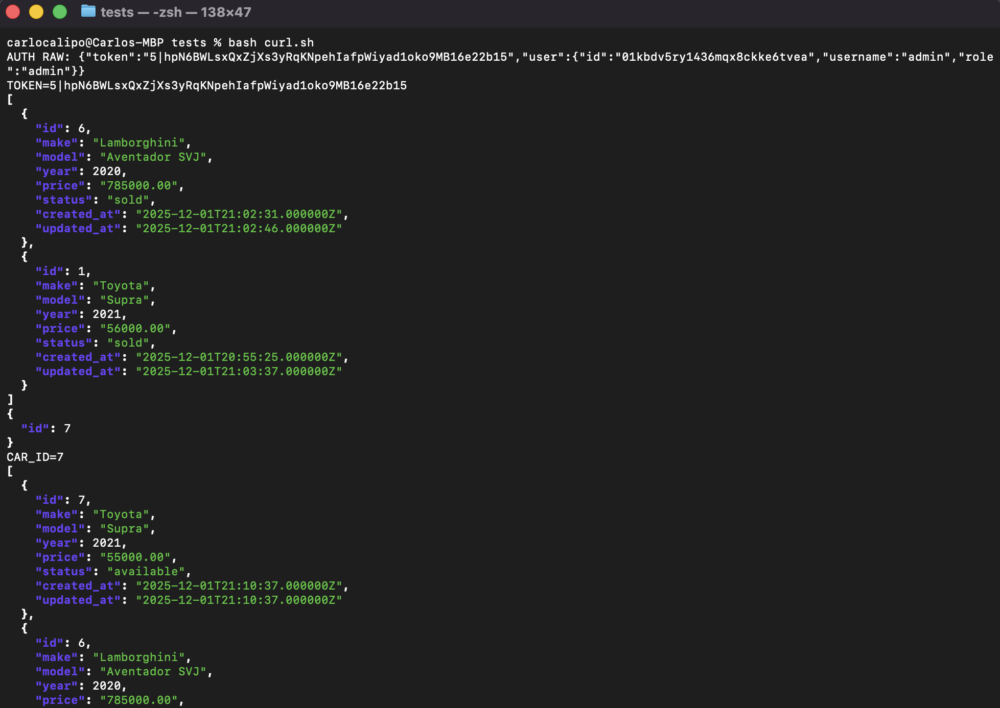

# ASE230 Project 2
## Laravel REST API + Docker + Hugo
Carlo Calipo

---

# Objectives
- Re-implement Project 1 API in Laravel 12
- Use Eloquent (no raw SQL) + Sanctum auth
- One-command deploy scripts & Docker stack
- Hugo docs + GitHub Pages (CI/CD)

---

# Architecture
- Laravel 12 + Sanctum
- MySQL 8 (Docker)
- Eloquent models: User (ULID), Car, Sale
- Protected routes for write operations

---

# API Endpoints
- `POST /api/auth/login`
- `GET /api/cars`, `GET /api/cars/{id}`
- `POST /api/cars` (auth)
- `PUT /api/cars/{id}` (auth)
- `DELETE /api/cars/{id}` (auth)
- `GET /api/sales`
- `POST /api/sales` (auth)

---

# Data Model
- `users` (ULID, role, password)
- `cars` (make, model, year, price, status)
- `sales` (car_id, customer_name, sale_price)
- Sanctum `personal_access_tokens`

---

# Seeder & Credentials
- Admin user: `admin` / `Carlo`
- Sample cars: Supra, Mustang (available)
- Idempotent seeding prevents duplicate admin
- ULID morphs on tokens to avoid truncation

---

# Setup – Local
```
cd code
./run.sh
```
- composer install
- `php artisan key:generate`
- `php artisan migrate --seed`
- Serves `http://localhost:8000/api`

---

# Evidence – run.sh (local stack)


---

# Setup – Docker
```
cd code
./setup.sh
```
- Builds PHP 8.4 image
- Starts MySQL + app containers
- Runs migrate --seed
- API at `http://localhost:8000/api`

---

# Auth Flow (Sanctum)
1. `POST /api/auth/login` with username/password
2. Verify password hash
3. Issue Sanctum token
4. Bearer token required for POST/PUT/DELETE

---

# Validation & Responses
- Laravel validation on create/update
- JSON-only responses
- Status codes: 200/201/400/401/403/404
- Deletes return `{deleted: true}`; 404 on refetch

---

# Scripts
- Local: `code/run.sh` (install, key:generate, migrate --seed, serve)
- Docker: `code/setup.sh` (build, start MySQL+app, migrate --seed)
- Tests: `code/tests/curl.sh`, `code/tests/tests.html`

---

# Docker Stack
- `Dockerfile` (PHP 8.4-cli, composer, artisan setup)
- `docker-compose.yml` (app + MySQL 8)
- Exposes API on `localhost:8000`

---

# Evidence – setup.sh


---

# Evidence – cURL Flow


---

# Evidence – Browser Tester


---

# Hugo Docs
- Content under `presentation/content`
- Custom layouts (no external theme)
- Published via GitHub Actions → GitHub Pages

---

# GitHub Actions (Pages)
- Workflow builds Hugo (`presentation/`) on push to main
- Deploys to `https://tofuszn.github.io/ASE_Project2/`
- Uses built-in `deploy-pages` action

---

# Portfolio
- `/portfolio/` highlights Projects 1 and 2
- Includes screenshots and links to docs and Marp decks
- Live on GitHub Pages

---

# Testing Strategy
- `curl.sh` covers login, CRUD cars, sale, delete
- `tests.html` for manual browser validation
- Seeded admin: `admin` / `Carlo`

---

# Troubleshooting
- Token insert errors → ensure ULID morph on tokens
- DB connection issues → verify `.env` host/port and MySQL up
- Pages links broken → check `baseURL` and rerun workflow
- Composer/PHP mismatch → Dockerfile set to PHP 8.4

---

# Lessons Learned
- ULID + Sanctum needs `ulidMorphs`
- PHP version must match composer.lock
- Canonical URLs required for GitHub Pages subpath
- Idempotent seeds prevent duplicate admin errors

---

# Next Steps
- Add pagination/filters to cars
- Add CI tests (PHPUnit) for controllers
- Add swagger/OpenAPI docs
- Publish OpenAPI and run tests in Actions
